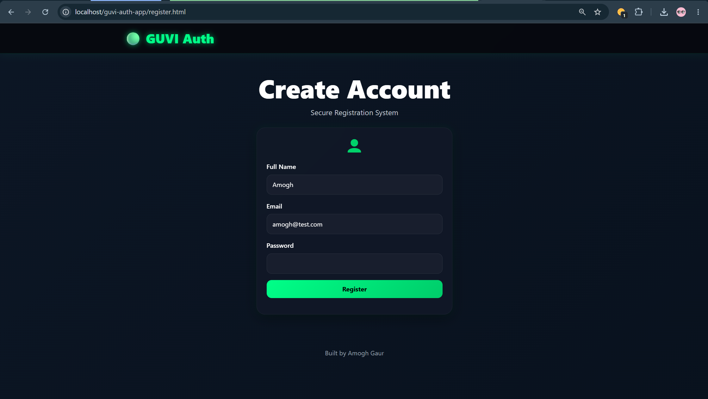
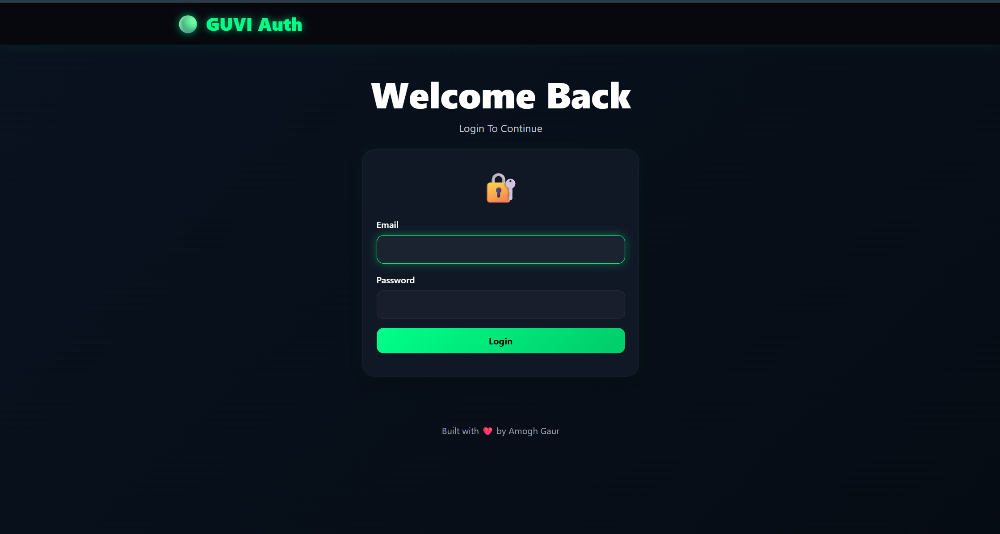
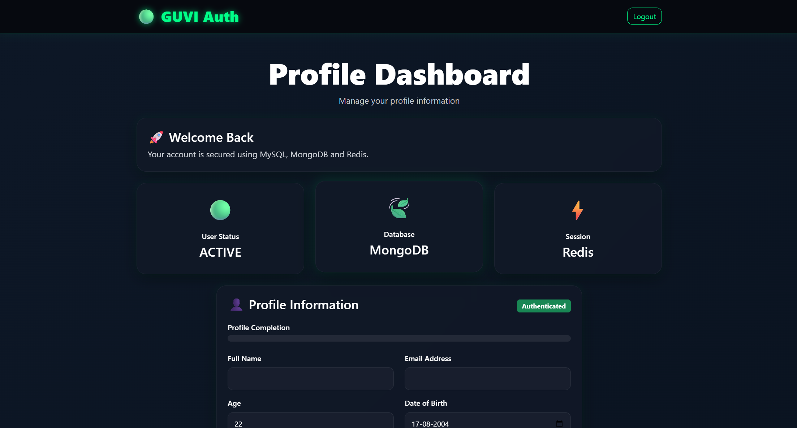
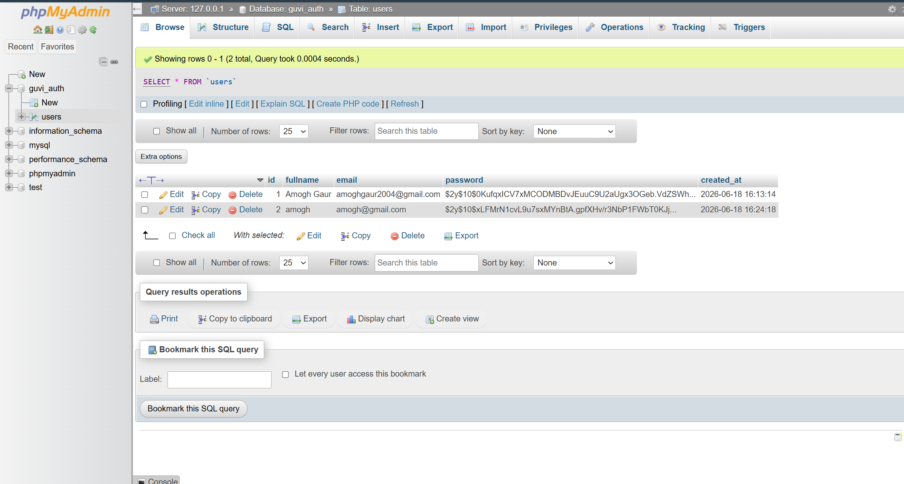
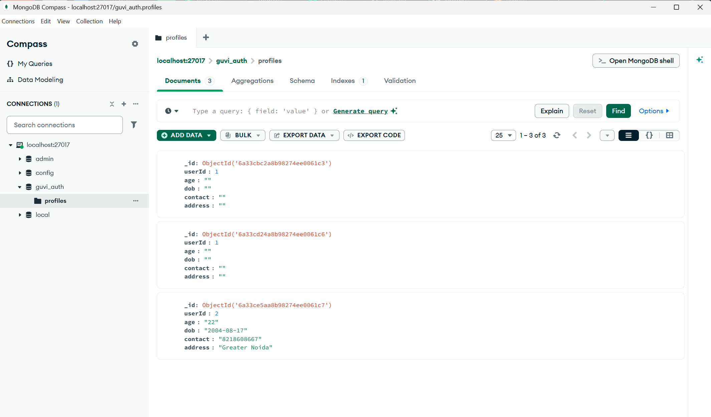
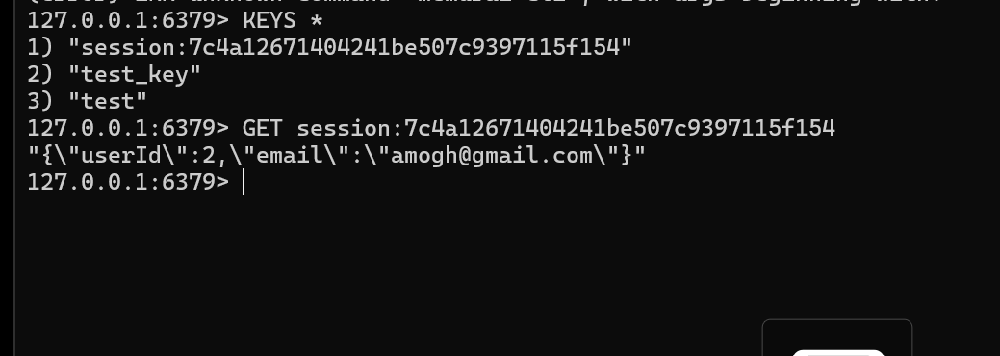

# GUVI Authentication System

A secure authentication web application built using PHP, MySQL, MongoDB, Redis, jQuery AJAX, and Bootstrap.

## Features

* User Registration
* User Login
* Password Hashing
* Session Management using Redis
* Profile Management
* MongoDB Profile Storage
* MySQL User Authentication
* AJAX-Based Communication
* Client-Side Validation
* Responsive Bootstrap UI
* Modern Dashboard Interface

## Tech Stack

### Frontend

* HTML5
* CSS3
* Bootstrap 5
* JavaScript
* jQuery AJAX

### Backend

* PHP 8

### Databases

* MySQL
* MongoDB

### Session Store

* Redis (Memurai)

## Project Structure

guvi-auth-app

├── assets

├── css

├── js

├── php

├── screenshots

├── register.html

├── login.html

├── profile.html

├── composer.json

└── composer.lock

## Database Architecture

### MySQL

Stores authentication data.

users

* id
* fullname
* email
* password

### MongoDB

Stores profile information.

profiles

* userId
* age
* dob
* contact
* address

### Redis

Stores session information.

* sessionId
* userId

## Screenshots

### Registration Page

### Login Page

### Profile Dashboard

### MySQL Users Table

### MongoDB Collection

### Redis Session

## Installation

1. Install XAMPP
2. Install MongoDB Community Server
3. Install Redis / Memurai
4. Clone Repository
5. Run Apache and MySQL
6. Configure MongoDB and Redis
7. Open:

http://localhost/guvi-auth-app/register.html

## Author

Amogh Gaur

ABES Engineering College

CSE AIML
